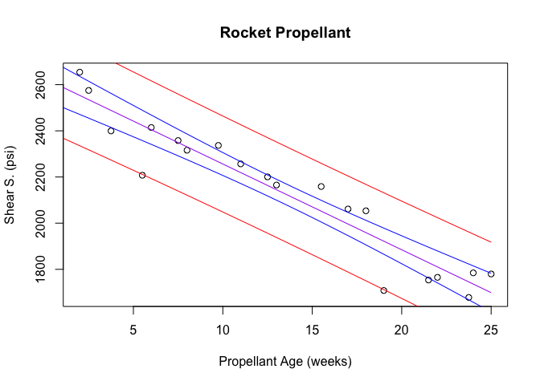
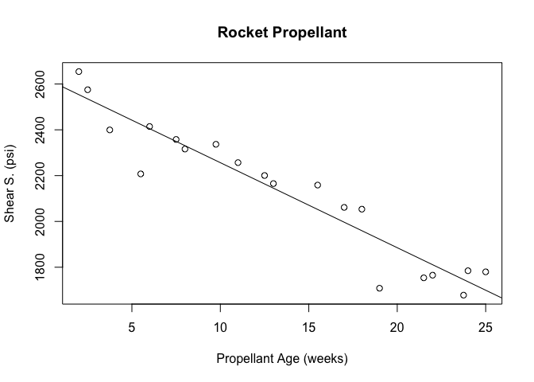
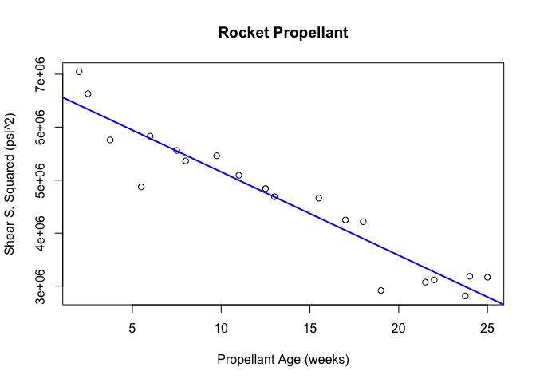

Math 50 Fall 2017, Homework \#2
================

**NOTE: For your homework download and use the template**
(<https://math.dartmouth.edu/~m50f17/HW2.Rmd>)

**Read the green comments in the rmd file to see where your answers
should go.**

## Question-1 (Sample)

-   Given a fixed confidence interval percentage (say 95%) at what value
    of x does CI on the mean response achieve its minimum width?  
-   The width of the interval is
    $2t\_{\\alpha/2,n-2}\\sqrt{MS\_{Res}((1/n)+(x\_0-\\bar{x})^2/S\_{xx}}$
-   and all terms inside the square root are positive. Therefore it is
    minimized when *x*<sub>0</sub> = *x̄*.
-   Write an R-chunk using the propellant data which computes the
    following.
    -   1.  Fit a simple linear regression model relating shear strength
            to age.

    -   2.  Plot scatter diagram.

    -   3.  Plot two lines (in blue color) that traces upper and lower
            limits of 95% confidence interval on
            *E*(*y*\|*x*<sub>0</sub>)

    -   4.  Plot two lines (in red color) that traces upper and lower
            limits of 95% prediction interval for *y*

    -   5.  Print the 95% quantile of the corresponding t distribution

``` r
prop<-read.table("https://math.dartmouth.edu/~m50f17/propellant.csv", header=T, sep=",")

shearS<-prop$ShearS 
age<-prop$Age

plot(age, shearS, xlab = "Propellant Age (weeks)", ylab = "Shear S. (psi)", main = "Rocket Propellant")
fitted <- lm(shearS ~ age)

ageList <- seq(0,25,0.5)
cList <- predict(fitted, list(age = ageList), int = "c", level = 0.95)
pList <- predict(fitted, list(age = ageList), int = "p", level = 0.95)

matlines(ageList, pList, lty='solid' ,  col = "red")
matlines(ageList, cList, lty = 'solid', col = "blue")
```

<!-- -->

``` r
# since n=20 we look at the t_18 distribution
wantedQuantile <- qt( 0.95, 18) ; 
```

95% quantile is of *t*<sub>18</sub> is : 1.7340636

## Question-2

-   Plot the same graph as in Question-1 without using R function
    predict, but instead directly calculating the interval limits we
    discussed in class.
-   In particular, what are the limits of 95% confidence interval on
    *E*(*y*\|*x*<sub>0</sub>)?

``` r
# Computation part of the answer : 

#creating scatter plot
prop<-read.table("https://math.dartmouth.edu/~m50f17/propellant.csv", header=T, sep=",")
shearS<-prop$ShearS 
age<-prop$Age
plot(age, shearS, xlab = "Propellant Age (weeks)", ylab = "Shear S. (psi)", main = "Rocket Propellant")

#preparing to create intervals
fitted <- lm(shearS ~ age)
yhat <- fitted$fitted.values
Sxx <- sum((age-mean(age))^2)
Sxy <- sum(shearS*(age-mean(age)))
beta_1_hat <- Sxy/Sxx
beta_0_hat <- mean(shearS) - beta_1_hat*(mean(age))
ageList <- seq(0,25,0.5)
mean_resp_hat = beta_0_hat + beta_1_hat*ageList
SSres = sum((shearS-yhat)^2)
MSres = SSres/18

#constructing confidence interval
conf_upper = mean_resp_hat + qt(1-0.05/2,18)*(MSres*(1/20 + ((ageList-mean(age))^2/Sxx)))^0.5
conf_lower = mean_resp_hat - qt(1-0.05/2,18)*(MSres*(1/20 + ((ageList-mean(age))^2/Sxx)))^0.5
matlines(ageList, conf_upper, lty='solid' ,  col = "blue")
matlines(ageList, conf_lower, lty = 'solid', col = "blue")

#constructing prediction interval
yhat = beta_0_hat + beta_1_hat*ageList
pred_upper = yhat + qt(1-0.05/2,18)*(MSres*(1+1/20 + ((ageList-mean(age))^2/Sxx)))^0.5
pred_lower = yhat - qt(1-0.05/2,18)*(MSres*(1+1/20 + ((ageList-mean(age))^2/Sxx)))^0.5
matlines(ageList, yhat, lty='solid' ,  col = "purple")
matlines(ageList, pred_upper, lty='solid' ,  col = "red")
matlines(ageList, pred_lower, lty = 'solid', col = "red")
```

<!-- -->

``` r
#determining E(y|x0) at x0 = xbar
ageList = mean(age)
mean_resp_hat = beta_0_hat + beta_1_hat*ageList
conf_upper_x_bar = mean_resp_hat + qt(1-0.05/2,18)*(MSres*(1/20 + ((ageList-mean(age))^2/Sxx)))^0.5
conf_lower_x_bar = mean_resp_hat - qt(1-0.05/2,18)*(MSres*(1/20 + ((ageList-mean(age))^2/Sxx)))^0.5
```

Limits of 95% confidence interval on *E*(*y*\|*x*<sub>0</sub>):
(2176.5062633, 2086.2087367)

## Question-3

-   Load the propellant data and fit a simple linear regression model
    relating shear strength to age.

### Part (a)

-   Test the hypothesis *β*<sub>1</sub> =  − 30 using confidence level
    97.5%.

``` r
#fitting model to data
prop<-read.table("https://math.dartmouth.edu/~m50f17/propellant.csv", header=T, sep=",")
shearS<-prop$ShearS 
age<-prop$Age
plot(age, shearS, xlab = "Propellant Age (weeks)", ylab = "Shear S. (psi)", main = "Rocket Propellant")
fitted <- lm(shearS ~ age)
yhat <- fitted$fitted.values
yBar = mean(shearS)
abline(fitted)
```

<!-- -->

``` r
#calculations
Sxx <- sum((age-mean(age))^2)
Sxy <- sum(shearS*(age-mean(age)))
beta_1_hat <- Sxy/Sxx
beta_0_hat <- mean(shearS) - beta_1_hat*(mean(age))
SSres = sum((shearS-yhat)^2)
MSres = SSres/18
SSt <- sum((shearS-yBar)^2)
SE_b1=(MSres/Sxx)^.5
SE_b0=(MSres*(1/20+((mean(age))^2)/Sxx))^.5
```

beta\_1 -30 does not lie in the 97.5% confidence interval for
*β*<sub>1</sub>: (-44.22, -30.09). Thus we reject this hypothesis and
conclude that *β*<sub>1</sub> ≠  − 30.

### Part (b)

-   Calculate the limits of 97.5% confidence interval for
    *β*<sub>0</sub> and *β*<sub>1</sub>

``` r
upper_beta_1 = beta_1_hat + qt(1-0.025/2,df=18)*SE_b1
lower_beta_1 = beta_1_hat - qt(1-0.025/2,df=18)*SE_b1
```

Upper Limit Beta 1: -30.0897092

Lower Limit Beta 1: -44.2174727

``` r
upper_beta_0 = beta_0_hat + qt(1-0.025/2,df=18)*SE_b0
lower_beta_0 = beta_0_hat - qt(1-0.025/2,df=18)*SE_b0
```

Upper Limit Beta 0: 2735.8522715

Lower Limit Beta 0: 2519.7924465

### Part (c)

-   Is there any relation between the answers you find in part (a)
    and (b) ?

If *β*<sub>1</sub> = *G* lies within the limits of the confidence
interval, one can conclude (with confidence at the given level) that G
can be the true *b**e**t**a*<sub>1</sub>. Contrarily, if
*β*<sub>1</sub> = *G* lies outside of the limits of the confidence
interval, at the given confidence level we conclude that G cannot be the
true *b**e**t**a*<sub>1</sub>. Another method of testing the hypothesis
would be via the calculation of p-values, but we should still get the
same results as we did with confidence intervals.

### Part (d)

-   Calculate *R*<sup>2</sup>

``` r
Rsq = 1 - SSres/SSt
```

R-squared: 0.9018414

## Question-4

-   Load the propellant data. This time let us consider a relation
    between square of shear strength and propellant age.

### Part (a)

-   Fit a simple linear regression model relating **square** of shear
    strength to age. Plot scatter diagram and fitted line.

``` r
prop<-read.table("https://math.dartmouth.edu/~m50f17/propellant.csv", header=T, sep=",")

shearS_sq<-(prop$ShearS)^2
age<-prop$Age
plot(age, shearS_sq, xlab = "Propellant Age (weeks)", ylab = "Shear S. Squared (psi^2)", main = "Rocket Propellant")
fitted <- lm(shearS_sq ~ age)
abline(fitted,lwd=2,col='blue')
```

<!-- -->

### Part (b)

-   Using analysis-of-variance test for significance of regression
    (using the formulas we discussed in class)

``` r
yhat <- fitted$fitted.values
SSr <- sum((yhat-mean(shearS_sq))^2)
SSres = sum((shearS_sq-yhat)^2)
MSr = SSr
MSres = SSres / 18
f_stat = MSr/MSres
limit = qf(0.95, 1, 18)
```

We calculate the F-statistic: 165.7173136, which does not belong in
confidence interval qf(0.95, 1, 18): (0, 4.41). Therefore, this is a
statistically significant result at 5% level and we reject the null
hypothesis of *b**e**t**a*<sub>1</sub> = 0. Thus, the test supports a
linear relationship.

### Part (c)

-   Use t-test and check significance of regression (using the formulas
    we discussed in class)

``` r
Sxx <- sum((age-mean(age))^2)
Sxy <- sum(shearS_sq*(age-mean(age)))
beta_1_hat <- Sxy/Sxx
t_stat = abs((beta_1_hat-0)/(MSres/Sxx)^0.5)
limit = qt(1-0.05/2,18)
```

t-statistic: 12.8731237, while qt(0.975): 2.100922. The t-statistic does
not belong in the confidence interval (-2.10, 2.10) at the 5% level,
thus we reject the null hypothesis of *b**e**t**a*<sub>1</sub> = 0.
Again, the test supports a linear relationship.

### Part (d)

-   Does the regression analysis predict a linear relationship between
    square of shear strength and propellant age ?

Yes, according to our results from b) and c), the regression analysis
predicts a linear relationship between square of shear strength and
propellant age.

## Question-5

-   Once again using propellant data fit a simple linear regression
    model between shear strength and propellant age.
-   Consider the t-test for hypothesis
    *β*<sub>1</sub> = *G*<sub>1</sub>, and develop a test for
    *β*<sub>1</sub> &gt; *G*<sub>1</sub> instead. Then

### Part (a)

-   Test the hypothesis *β*<sub>1</sub> &gt;  − 50 with confidence level
    99.9%.

``` r
prop<-read.table("https://math.dartmouth.edu/~m50f17/propellant.csv", header=T, sep=",")
shearS<-prop$ShearS
age<-prop$Age
plot(age, shearS, xlab = "Propellant Age (weeks)", ylab = "Shear S. (psi)", main = "Rocket Propellant")
fitted <- lm(shearS ~ age)
abline(fitted,lwd=2,col='blue')
```

<!-- -->

``` r
Sxx <- sum((age-mean(age))^2)
Sxy <- sum(shearS*(age-mean(age)))
beta_1_hat <- Sxy/Sxx
yhat <- fitted$fitted.values
SSres = sum((shearS-yhat)^2)
MSres = SSres / 18
t_stat = abs((beta_1_hat-(-50))/(MSres/Sxx)^0.5)
p_val = pt(t_stat, 18)
```

It was found that the t-statistic: 4.4464989. It follows that the
p-value: 0.9998441. This is greater than the significance level of
*α* = 0.001 and thus we fail to reject the null hypothesis. We conclude
at the 0.1% level that the true *b**e**t**a*<sub>1</sub> is greater than
-50.

### Part (b)

-   Find the smallest value *G*<sub>1</sub> such that the hypothesis
    *β*<sub>1</sub> &gt; *G*<sub>1</sub> is rejected.

``` r
guess = -(qt(0.001, 18)*(MSres/Sxx)^0.5-beta_1_hat)
```

G\_1: -26.7225154

### Part (c) Similarly what is the smallest value *G*<sub>0</sub> such that the hypothesis *β*<sub>0</sub> &gt; *G*<sub>0</sub> is rejected.

``` r
guess = -(qt(0.001, 18)*(MSres*(1/20 + ((mean(age))^2/Sxx)))^0.5-beta_0_hat)
```
